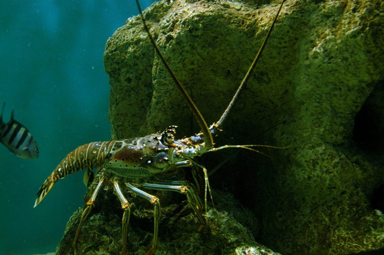

```{r setup, include=FALSE}
knitr::opts_chunk$set(echo = TRUE)
```

## Why are these areas closed to spiny lobster trap fishing?
NOAA Fisheries Service and the Gulf and South Atlantic Fishery Management Councils have created closed areas to protect threatened staghorn and elkhorn coral (Acropora spp.) Prohibiting the use of
lobster traps near these corals reduces their risk of damage due to trap movement caused mostly by
storms.

## Why are these corals protected?
Staghorn and elkhorn corals are a food source and provide important habitat for many different fish and invertebrates including spiny lobster. Staghorn and elkhorn coral populations have been reduced by 90-95% since 1980.

The shows only coral areas and closures in federal waters because the Gulf and
South Atlantic Councils’ management area are limited to federal waters.


<div style="width:150px; height=100px">

</div>
